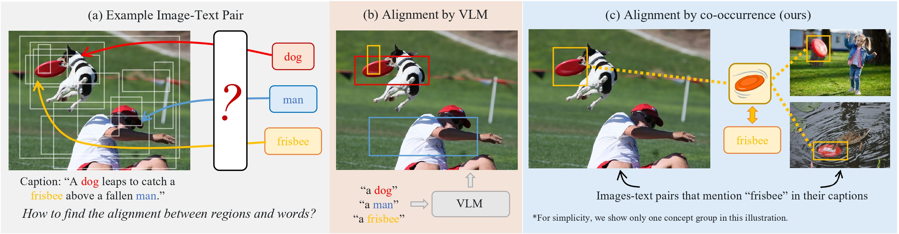

# CoDet: Co-Occurrence Guided Region-Word Alignment for Open-Vocabulary Object Detection

<p align="center">  </p>

> [**CoDet: Co-Occurrence Guided Region-Word Alignment for Open-Vocabulary Object Detection**](https://arxiv.org/abs/2310.16667),               
> Chuofan Ma, Yi Jiang, Xin Wen, Zehuan Yuan, Xiaojuan Qi   
> *NeurIPS 2023 ([https://arxiv.org/abs/2310.16667](https://arxiv.org/abs/2310.16667))*    
> *Project page ([https://codet-ovd.github.io](https://codet-ovd.github.io))*
> 
> [](https://paperswithcode.com/sota/open-vocabulary-object-detection-on-lvis-v1-0?p=codet-co-occurrence-guided-region-word-1)


## Features
- Train an open-vocabulary detector with web-scale image-text pairs
- Align regions and words by co-occurrence instead of region-text similarity
- State-of-the-art performance on open-vocabulary LVIS
- Deployed with modern visual foudation models
- Intergated with [roboflow](https://github.com/autodistill/autodistill-codet) to automatically label images for training a small, fine-tuned model


## Installation
Setup environment
```shell script
conda create --name codet python=3.8 -y && conda activate codet
pip install torch==1.12.1+cu116 torchvision==0.13.1+cu116 --extra-index-url https://download.pytorch.org/whl/cu116
git clone https://github.com/CVMI-Lab/CoDet.git
```

Install [Apex](https://github.com/NVIDIA/apex#linux) and [xFormer](https://github.com/facebookresearch/xformers#installing-xformers) (You can skip this part if you do not use EVA-02 backbone)
```shell script
pip install ninja
pip install -v -U git+https://github.com/facebookresearch/xformers.git@7e05e2caaaf8060c1c6baadc2b04db02d5458a94
git clone https://github.com/NVIDIA/apex && cd apex
pip install -v --disable-pip-version-check --no-cache-dir --no-build-isolation --global-option="--cpp_ext" --global-option="--cuda_ext" ./ && cd ..
```

Install detectron2 and other dependencies
```shell script
cd CoDet/third_party/detectron2
pip install -e .
cd ../..
pip install -r requirements.txt
```


## Prepare Datasets
We use [LVIS](https://www.lvisdataset.org/) and [Conceptual Caption (CC3M)](https://ai.google.com/research/ConceptualCaptions/) for OV-LVIS experimets,
[COCO](https://cocodataset.org/) for OV-COCO experiments,
and [Objects365](https://www.objects365.org/) for cross-dataset evaluation.
Before starting processing, please download the (selected) datasets from the official websites and place or sim-link them under `CoDet/datasets/`. 
`CoDet/datasets/metadata/` is the preprocessed meta-data (included in the repo).
Please refer to [DATA.md](docs/DATA.md) for more details.
```
$CoDet/datasets/
    metadata/
    lvis/
    coco/
    cc3m/
    objects365/
```

## Model Zoo
### OV-COCO
| Backbone |   Box AP50   |   Box AP50_novel   | Config | Model |
|:--------:|:------------:|:------------------:|:------:|:-----:|
| ResNet50 | 46.8 | 30.6 | [CoDet_OVCOCO_R50_1x.yaml](configs/CoDet_OVCOCO_R50_1x.yaml) |  [ckpt](https://drive.google.com/file/d/1uYX7Jm61TghEtop94fMymBS6AUR66T8k/view?usp=sharing)  |

### OV-LVIS
| Backbone |   Mask mAP   |   Mask mAP_novel   | Config | Model |
|:--------:|:------------:|:------------------:|:------:|:-----:|
| ResNet50 | 31.3 | 23.7 | [CoDet_OVLVIS_R5021k_4x_ft4x.yaml](configs/CoDet_OVLVIS_R5021k_4x_ft4x.yaml) |  [ckpt](https://drive.google.com/file/d/1-chsmrh5fahOOSa4G2o5Mi6W2mGuMtG-/view?usp=sharing)  |
| Swin-B | 39.2 | 29.4 | [CoDet_OVLVIS_SwinB_4x_ft4x.yaml](configs/CoDet_OVLVIS_SwinB_4x_ft4x.yaml) |  [ckpt](https://drive.google.com/file/d/1ut1K8IsdD2A4uK0xVtPRDg1r4FubH8Pq/view?usp=sharing)  |
| EVA02-L | 44.7 | 37.0 | [CoDet_OVLVIS_EVA_4x.yaml](configs/CoDet_OVLVIS_EVA_4x.yaml) |  [ckpt](https://drive.google.com/file/d/1oILkFkIlbEgCCLqCLyJJ5ZDHG1bd0aWN/view?usp=sharing)  |


## Inference
To test with custom images/videos, run
```shell script
python demo.py --config-file [config_file] --input [your_image_file] --output [output_file_path] --vocabulary lvis --opts MODEL.WEIGHTS [model_weights]
```

Or you can customize the test vocabulary, e.g.,
```shell script
python demo.py --config-file [config_file] --input [your_image_file] --output [output_file_path] --vocabulary custom --custom_vocabulary headphone,webcam,paper,coffe --confidence-threshold 0.3 --opts MODEL.WEIGHTS [model_weights]
```

To evaluate a pre-trained model, run
```shell script
python train_net.py --num-gpus $GPU_NUM --config-file /path/to/config --eval-only MODEL.WEIGHTS /path/to/ckpt
```

To evaluate a pre-trained model on Objects365 (cross-dataset evaluation), run
```shell script
python train_net.py --num-gpus $GPU_NUM --config-file /path/to/config --eval-only MODEL.WEIGHTS /path/to/ckpt DATASETS.TEST "('objects365_v2_val',)" MODEL.RESET_CLS_TESTS True MODEL.TEST_CLASSIFIERS "('datasets/metadata/o365_clip_a+cnamefix.npy',)" MODEL.TEST_NUM_CLASSES "(365,)" MODEL.MASK_ON False
```

## Training
Training configurations used by the paper are listed in `CoDet/configs`.
Most config files require pre-trained model weights for initialization (indicated by MODEL.WEIGHTS in the config file).
Please train or download the corresponding pre-trained models and place them under `CoDet/models/` before training.

| Name |   Model   |
|:----|:---------|
| resnet50_miil_21k.pkl | ResNet50-21K pretrain from [MIIL](https://github.com/Alibaba-MIIL/ImageNet21K#1-pretrained-models--on-imagenet-21k-p-dataset) |
| swin_base_patch4_window7_224_22k.pkl | SwinB-21K pretrain from [Swin-Transformer](https://github.com/microsoft/Swin-Transformer#main-results-on-imagenet-with-pretrained-models) |
| eva02_L_pt_m38m_p14to16.pt | EVA02-L mixed 38M pretrain from [EVA](https://github.com/baaivision/EVA/tree/master/EVA-02/asuka#mim-pre-trained-eva-02) |
| BoxSup_OVCOCO_CLIP_R50_1x.pth | ResNet50 COCO base class pretrain from [Detic](https://github.com/facebookresearch/Detic/blob/main/docs/MODEL_ZOO.md#open-vocabulary-coco) |
| BoxSup-C2_Lbase_CLIP_R5021k_640b64_4x.pth | ResNet50 LVIS base class pretrain from [Detic](https://github.com/facebookresearch/Detic/blob/main/docs/MODEL_ZOO.md#open-vocabulary-lvis) |
| BoxSup-C2_Lbase_CLIP_SwinB_896b32_4x.pth | SwinB LVIS base class pretrain from [Detic](https://github.com/facebookresearch/Detic/blob/main/docs/MODEL_ZOO.md#open-vocabulary-lvis) |

To train on a single node, run
```shell script
python train_net.py --num-gpus $GPU_NUM --config-file /path/to/config
```
Note: By default, we use 8 V100 for training with ResNet50 or SwinB, and 16 A100 for training with EVA02-L.
Please remember to re-scale the learning rate accordingly if you are using a different number of GPUs for training.


## Citation

If you find this repo useful for your research, please consider citing our paper:
```
@inproceedings{ma2023codet,
  title={CoDet: Co-Occurrence Guided Region-Word Alignment for Open-Vocabulary Object Detection},
  author={Ma, Chuofan and Jiang, Yi and Wen, Xin and Yuan, Zehuan and Qi, Xiaojuan},
  booktitle={Advances in Neural Information Processing Systems},
  year={2023}
}
```

## Acknowledgment
CoDet is built upon the awesome works [Detic](https://github.com/facebookresearch/Detic/tree/main) and [EVA](https://github.com/baaivision/EVA/tree/master).

## License
This project is licensed under the Apache License 2.0 - see the [LICENSE](docs/LICENSE) file for details.
